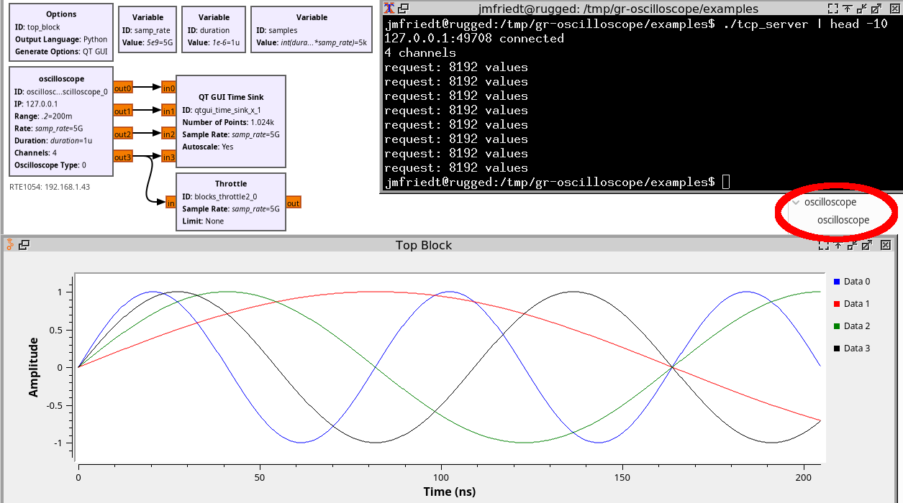

# gr-oscilloscope
Using an oscilloscope as Software Defined Radio source for GNU Radio. 

The ``master`` branch supports GNU Radio 3.10, while branches for 3.7 and 3.8 are 
available for older GNU Radio versions.

Assumes the availability of RPC for communication over VXI11 with an oscilloscope.
Tested on Rohde & Schwarz RTO2034 and RTE1054, will most probably work on any RT series
oscilloscopes. Origianlly developed for the Agilent 54855DSO but not tested after
adding support for R&S instruments. Pull-down menu for selecting which oscilloscope is 
used: 0 for a dummy data source provided by the TCP/IP server in the ``examples`` directory
(see screenshot below), 1 for R&S, 2 for Agilent.

For those wanting to test ``gr-oscilloscope`` with no hardware access, a TCP server generating
dummy data (sine waves) is available in ``examples``. Compile manually (``make`` or ``gcc -o tcp_server 
tcp_server.c -lm``) and execute (``./examples/tcp_server``) to connect the server to port 9999 of
the localhost. TCP/IP dummy data communication is activated by selecting option 0 in the ``Type`` field.



## Troubleshooting

If getting an error message when executing such as
```
ImportError: libgnuradio-oscilloscope.so.1.0.0: cannot open shared object file: No such file or directory
```
make sure to
```
export LD_LIBRARY_PATH=/usr/local/lib/x86_64-linux-gnu
```
in the terminal used to launch GNU Radio before running ``gnuradio-companion``

## Example

gr-oscilloscop is used by https://github.com/tlavarenne/gr-ethernet/ for decoding Ethernet frames
in real time, assuming a radiofrequency grade oscilloscope with differential probes is available.
