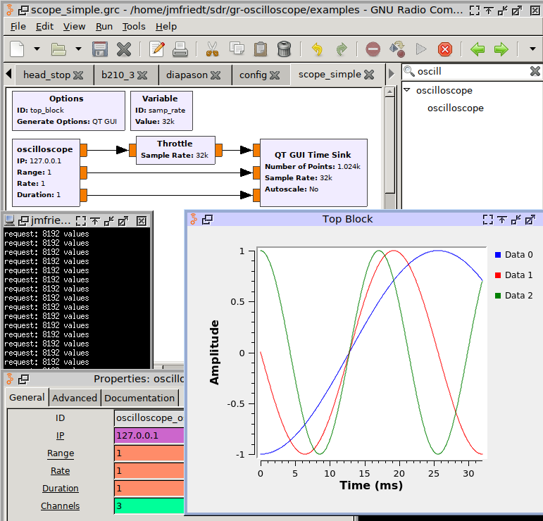

# gr-oscilloscope
Using an oscilloscope as Software Defined Radio source for GNU Radio. 

The ``master`` branch supports GNU Radio 3.10, while branches for 3.7 and 3.8 are 
available for older GNU Radio versions.

Assumes the availability of RPC for communication over VXI11 with an oscilloscope.
Tested on Rohde & Schwarz RTO2034 and RTE1054, will most probably work on any RT series
oscilloscopes. Origianlly developed for the Agilent 54855DSO but not tested after
adding support for R&S instruments. Select which brand is used with the #define flags
in the lib/ directory source code (``#define rohdeschwarz`` is exclusive with ``#define agilent``).

For those wanting to test ``gr-oscilloscope`` with no hardware access, a TCP server generating
dummy data (sine waves) is available in examples. Compile manually (``gcc -o tcp_server 
tcp_server.c -lm``) and execute (``./examples/tcp_server``) to connect the server to port 9999 of
the localhost. TCP/IP dummy data communication is activated by selecting as IP address
of the gr-oscilloscope "oscilloscope" block 127.0.0.1.

