# Examples

## TCP/IP virtual instrument server

The TCP/IP server in this directory is compiled with ``make`` to produce
``tcp_server``. Launch ``tcp_server`` in a terminal (top-right on the
screenshot below), and in GNU Radio Companion ``gnuradio310_tcpip.grc`` 
leading the the following output:

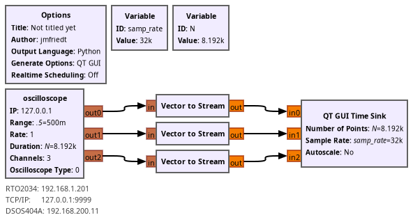

The server generates as many sine waves as declared channel, first argument
sent by the client to the server. Tested July 2026 with GNU Radio 3.10.12.0
(Python 3.13.12). The vector to stream is needed since the gr-oscilloscope 
block naturally generates vector with ``duration * samp_rate`` samples on each
channel

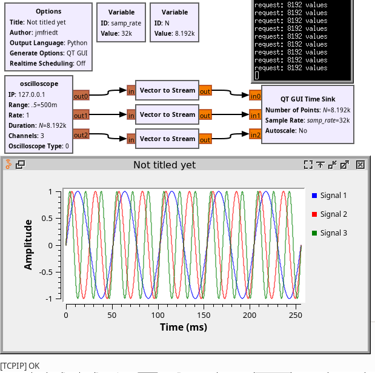

## Agilent oscilloscope

Tested on a DSOS404A, with the IP address defined in the MS-Windows Network
Interface IPv4 configuration menu.

Flowchart, including the cross-correlation in the Fourier domain, emphasizing
the benefit of the vector output avoiding the ``Stream to Vector`` block before
each FFT (but requiring the ``Vector to stream`` before each oscilloscope/``Time Sink`` input): 

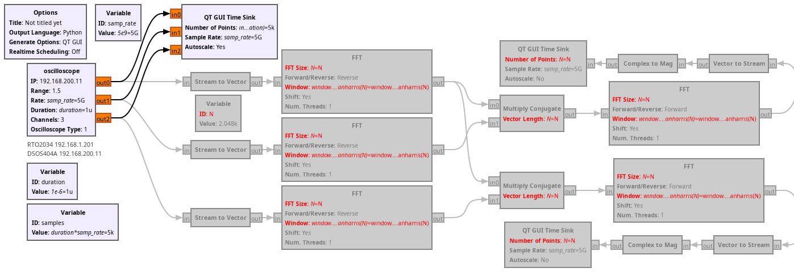

Time sink outputs with the FFT blocks commented:

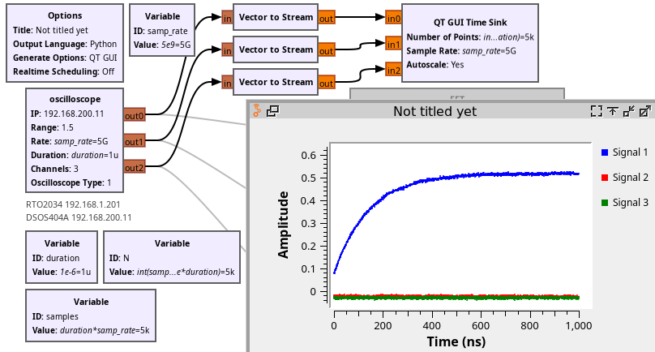

Time sink outputs with the FFT blocks running:

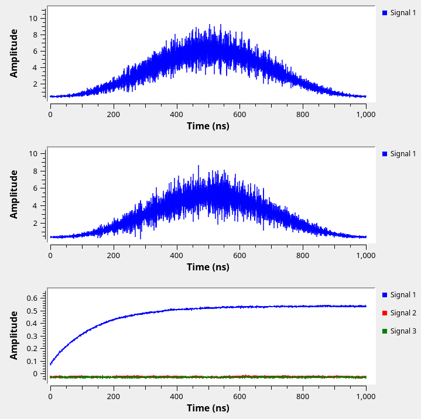

Screenshot of the oscilloscope showing how channel 1 is connected to the
test signal to trigger the acquisitions, while channels 2 and 3 are floating:

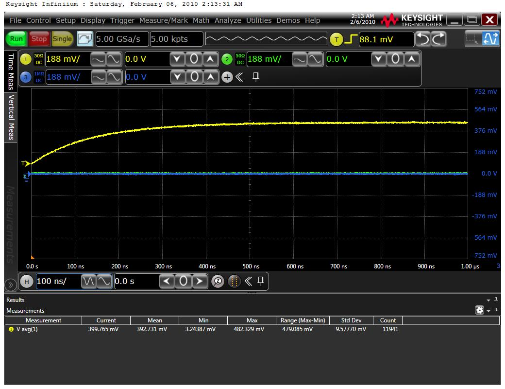

## Rigol oscilloscope

Tested on the DHO814, setting the IP address by hitting on the bottom left
Rigol icon of the touchscreen, Utility and Static IP. After setting the static
IP address and disabling DHCP and Auto IP, **drag the window** up and click
on "Apply" hidden at the bottom of the menu.

GNU Radio Companion flowchart:

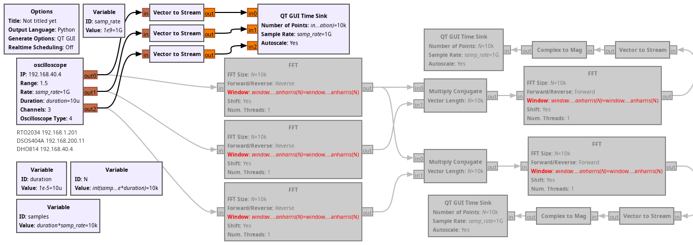

Oscilloscope display, with a probe connecting channel1 to the test signal:

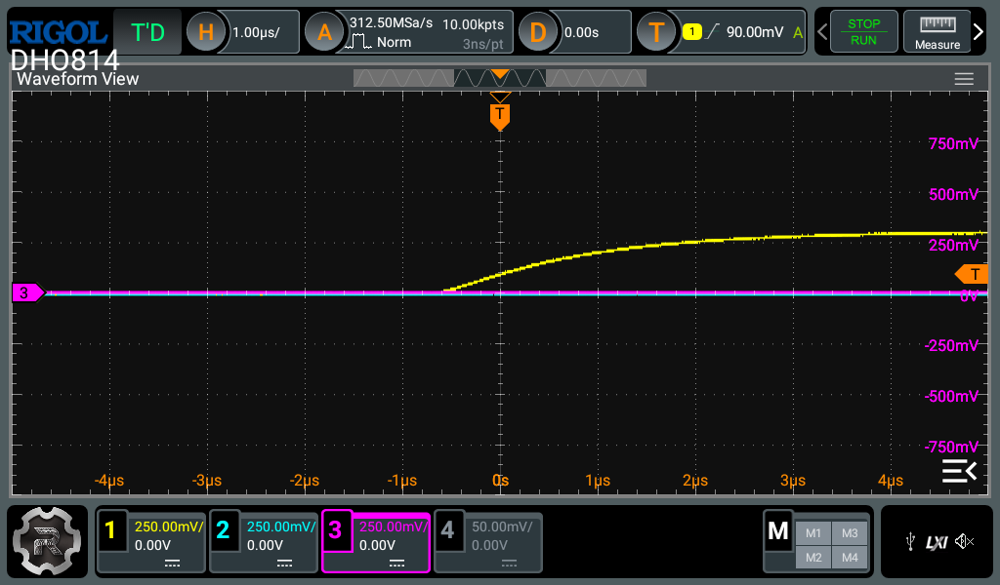

Screenshot of data collection from the Rigol DHO814 with GNU Radio:

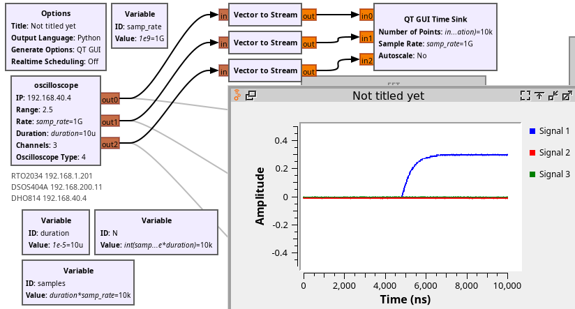

1. At startup, one remote command error message is displayed: although it does not
prevent acquisition, it should be corrected
2. When requesting e.g 1 GS/s as advertised on the oscillscope panel, the record duration
will actually lead to the selection of the most appropriate sampling rate, irrelevant
of the requested value. In our case, with 10 us the sampling rate was automatically selected
to 312.5 MS/s instead of the requested 1 GS/s
3. Data collection sometimes fails, as detected when the first and last sample of channel1
are equal to 0. In this case, a new trace is collected for display.

## Rohde & Schwarz oscilloscope


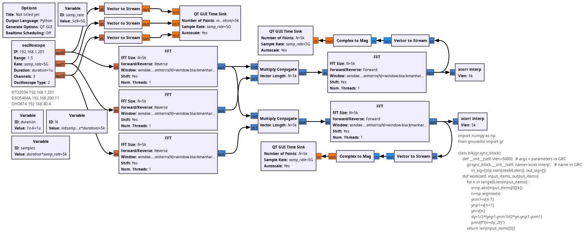

In order to demonstrate sub-sampling period resolution, a parabolic fit of the cross-correlation
magnitude is implemented. Recording the cross-correlation peak position after oversampling led to
the file ``gnuradio310_xcorr_RS.txt`` processed using <a href="gnuradio310_xcorr_RS.m">gnuradio310_xcorr_RS.m</a>
whose output is:

```
m1 = 35.159
ans = 4.2151e-03
m2 = 25.160
ans = 2.3069e-03
ans = 1.9997
ans = 7.0317
ans = 5.0320
```
meaning that the mean value of the first correlation peak is $25160\pm 2.3$ ps and the second is  $35159\pm 4.2$ ps 
translated to a length, assuming a speed of light of 0.2 m/ns in RG-58 coaxial cable, to 5.032 m and 7.032 m total
length (4 ps is 0.8 mm uncertainty in the cable) matching the assembly of one 5-m long RG-58 cable followed by one
2-m long cable.

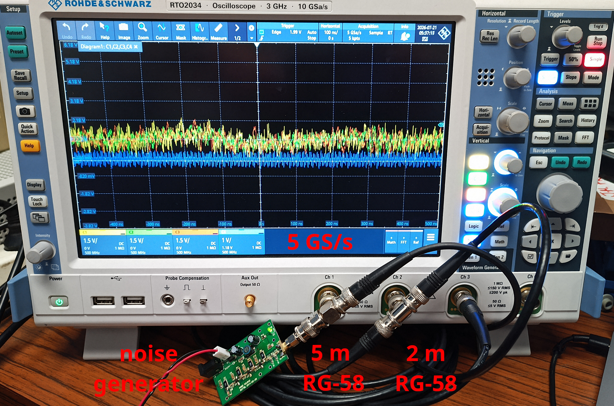

## LeCroy oscilloscope

Recent (e.g. WaveRunner 625Zi) LeCroy oscilloscopes support VXI11/SCPI mode, see 
Utilities -> Remote -> LXI (VXI11) instead of TCPIP (VICP).

The 625Zi oscilloscope was tested with the LeCroy compatibility mode. However **setting the 
sampling rate and duration** are not implemented, only the user settings are kept for these
parameters (voltage range configuration is working).

**TODO**: set sampling rate and measurement duration (instead of the number of samples as product
of these two quantities).

Oscilloscope screen capture:

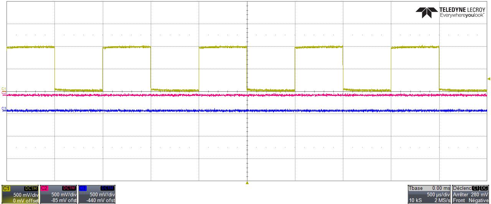

GNU Radio gr-oscilloscope screen capture when probing the test signal on channel 1, with
channels 2 and 3 left floating:

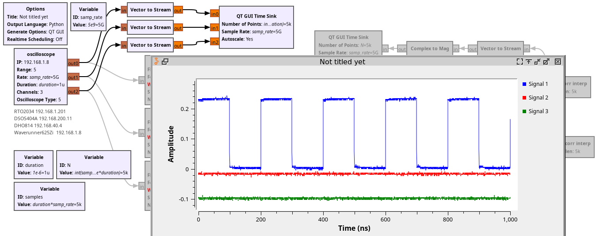

## Tektronix oscilloscope

